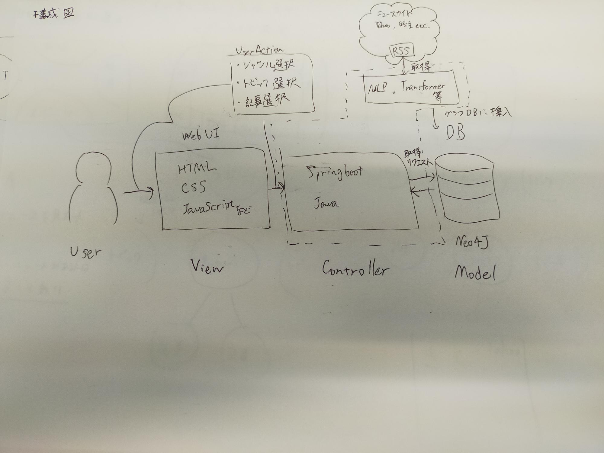
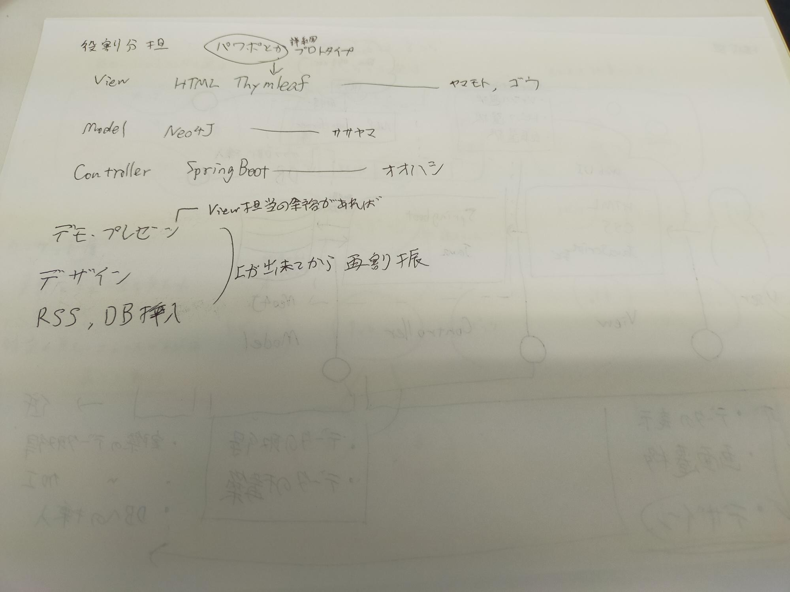

# Documentation
## Members
- Maxi
- Raiga
- Riku
- Kazusa
## Project
### Overview

セマンティックネット風ニュースサイト

## 構成
- Web UI
- コントローラ
- データベース
  

---

## Web UI

### Creater
- Riku 
- Kazusa

### Overview
HTML, CSS, JavaScriptなどで作成.

ユーザアクション(ジャンル選択, トピック選択, 記事選択などのユーザ入力)をコントローラに渡す役割.

---

## コントローラ

### Creater
- Maxi

### Overview
SpringBootを使用してJavaで作成.

Web UIからユーザ入力を受け取り, データベースから関連するデータを取得する.

---

## データベース

### Creater
- Raiga
  
### Overview
Neo4Jで作成

データとそのリンクを保存 

## 設計図

## 役割分担
